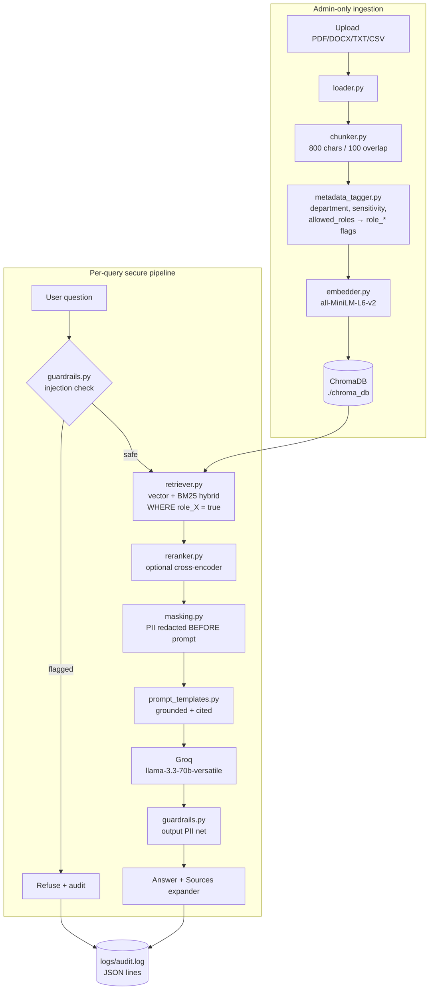

# 🔐 Secure Enterprise RAG Chatbot

A document-intelligence platform with **role-based access control (RBAC)**,
**PII masking**, and **prompt-injection guardrails**, built on LangChain,
ChromaDB, Groq (Llama 3.3 70B), sentence-transformers, and Streamlit.

## Architecture



## How RBAC works (pre-filtering, not post-filtering)

1. **At ingestion**, `metadata_tagger.py` takes the document's
   `allowed_roles` list and *explodes* it into one boolean metadata flag per
   role on every chunk (`role_hr: true`, `role_general: false`, …). ChromaDB
   metadata can't hold lists or do substring matches, so booleans are what
   make database-side filtering possible. `admin` is always added.
2. **At query time**, `retriever.py` passes `where={"role_<user's role>":
   True}` *inside* the ChromaDB query. Forbidden chunks are excluded by the
   database **before similarity ranking** — they never appear in candidate
   lists, logs, or prompts. There is no post-hoc filtering anywhere.
3. Hybrid (BM25) mode builds its keyword corpus from a `collection.get()`
   call using the **same** role filter, so it preserves the guarantee.

## How masking works

- `masking.py` detects PII with **Presidio** when available and always runs
  a **regex fallback** (SSN, credit card, email, phone, salary figures), so
  a missing optional dependency degrades accuracy — never disables masking.
- A per-role allowlist (`ROLE_VISIBLE_ENTITIES`) decides what stays
  unmasked: admin sees everything, HR sees salaries/contact info, everyone
  else gets `[REDACTED:<TYPE>]`.
- Masking runs on retrieved chunks **before the LLM prompt is built**
  (`chain.py`, step 4). The model never receives PII the user can't see,
  so no paraphrasing trick can extract it. `guardrails.py` re-scans the
  final answer as a defense-in-depth second net.

## Guardrails

- **Input:** questions matching injection patterns ("ignore previous
  instructions", "reveal your system prompt", fake `<system>` tags, "don't
  mask…") are refused before retrieval and written to the audit log.
- **Output:** the answer is re-scanned for SSN/credit-card shapes and
  redacted if anything slipped through.

## Setup

```bash
# 1. Install dependencies (Python 3.10+)
pip install -r requirements.txt

# 2. Configure your Groq API key (free at https://console.groq.com)
copy .env.example .env        # then edit .env and paste your key

# 3. Ingest the sample documents (--reset wipes any leftover data first)
python -m scripts.ingest_samples --reset

# 4. Verify RBAC + masking (should print PASS)
python -m scripts.eval_retrieval

# 5. See the security guarantees live in the terminal (no API key needed)
python -m scripts.demo

# 6. Run the full app
streamlit run app.py
```

> Presidio is optional: if `presidio-analyzer`/its spaCy model aren't
> installed, masking automatically uses the regex fallback.

## Demo accounts

| Username | Password | Role | Can see |
|---|---|---|---|
| admin | admin123 | admin | everything, unmasked |
| hannah | hr123 | hr | HR policy (salaries visible, cards/SSNs masked) |
| frank | fin123 | finance | Q3 finance report |
| erin | eng123 | engineering | engineering architecture doc |
| guest | guest123 | general | engineering architecture doc (internal) |

Try logging in as `guest` and asking *"What is John Mitchell's salary?"* —
retrieval returns nothing from the HR document, so the bot answers that it
has no information. The same question as `admin` returns the (unmasked)
answer with citations.

## Project layout

```
app.py                  Streamlit UI (login, chat, admin upload)
config.py               settings, roles, mock users, .env loading
ingestion/              loader → chunker → metadata_tagger → embedder
retrieval/              vector_store, RBAC-filtered retriever, reranker
security/               auth, PII masking, guardrails
llm/                    prompt templates, secure RAG chain
utils/logger.py         JSON-lines audit trail (logs/audit.log)
scripts/                ingest_samples.py, eval_retrieval.py
sample_docs/            3 dummy enterprise docs with different access policies
```

## Audit trail

Every query (including blocked injections and uploads) appends a JSON line
to `logs/audit.log` with user, role, question, retrieved sources
(names/metadata only — never chunk text), masked entity types, and
timestamp.
